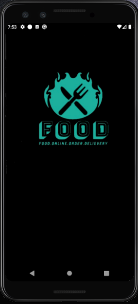

# Food Delievery App
A demo food delievery application built using react-native.

### To make it run on local system :
- Clone the project by using command
     
     ***If using HTTPS:***             
    
       git clone https://github.com/Tarun-555/Food_delievery_app.git
       
     ***If using SSH:***
     
       git clone git@github.com:Tarun-555/Food_delievery_app.git
- Once done with cloning, go inside the cloned project directory and run command

      npm install
      
     which installs all the necessary dependencies required and mentioned in package.json file

- For backend, I'm using firebase in this project. your are free to choose your own backend server which ever you like.

  If you are likely to use firebase as your backend. you can refer this docs:
  
  
- I have been using Redux for state management for this project.

#### SCREENSHOTS
    &nbsp;&nbsp;&nbsp;
    &nbsp;&nbsp;&nbsp;
  
